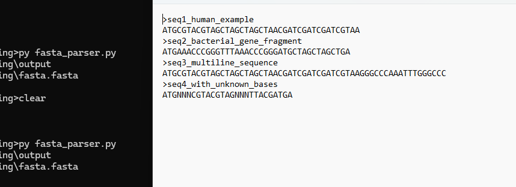

#### Small FASTA parser as a python scritp that launches notepad for output overview

- complete path construction i/o
- multiline sequence reads and ligation
- ran as a .py script with notepad.exe displaying the result of parsed file
---

[]

---

